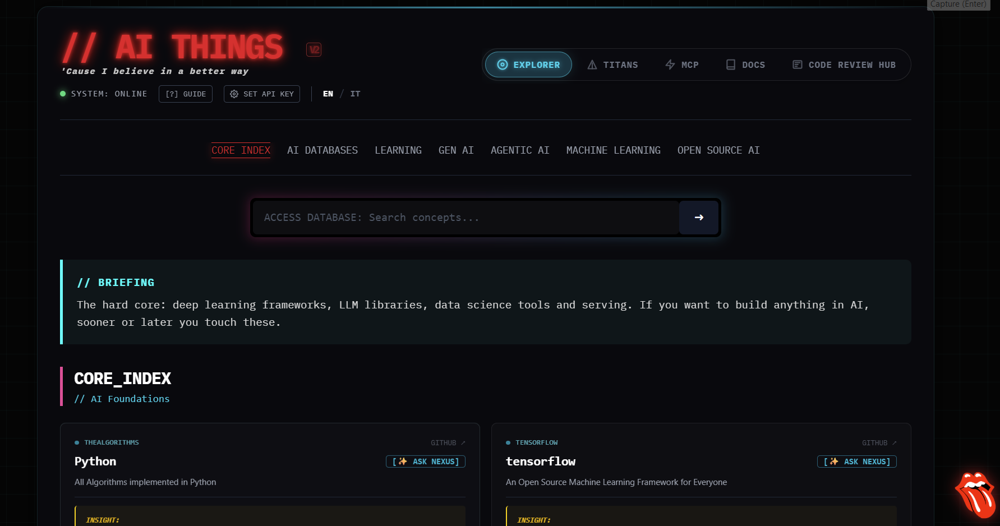
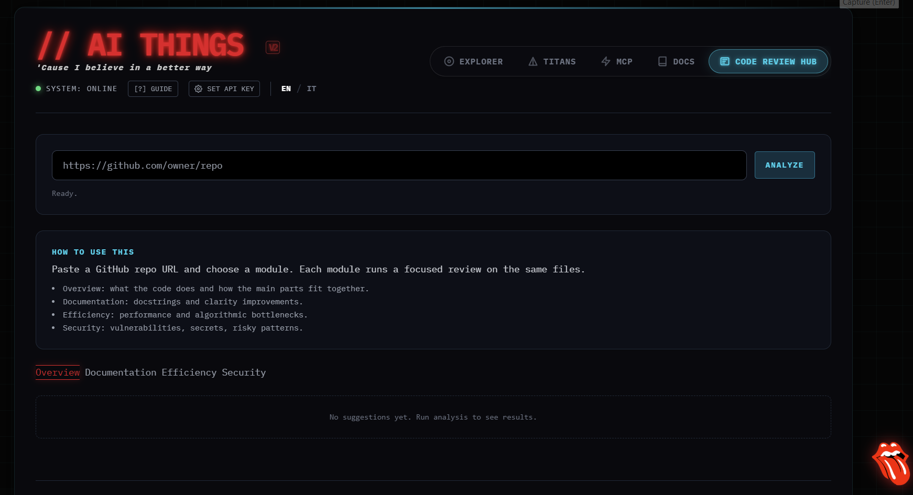
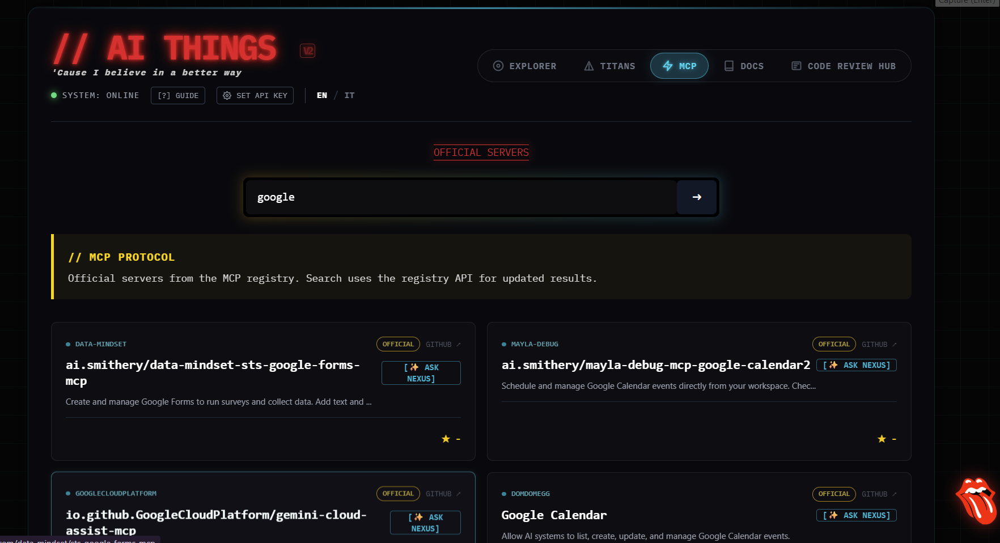

# AI THINGS / AI NEXUS Knowledge Explorer (V2)

AI THINGS is a cyberpunk knowledge explorer for the AI ecosystem with an integrated assistant, NEXUS AI. It is a single-page HTML app with no build step.

## Mission / Scopo

- IT: Diffondere la conoscenza e favorire l'uso dell'AI per tutti. Rendere chiaro cosa usare, perche, e come partire.
- EN: Spread AI knowledge and help everyone use AI. Make it clear what to use, why, and how to start.

## Live demo

https://giacomomarani.github.io/AI-THINGS/

## UI screenshots






## Core features

- Knowledge Explorer: curated open source repos by category, with search and quick access.
- Titans (Corporate stacks): snapshots of Big Tech AI stacks and services.
- MCP Registry: official MCP (Model Context Protocol) servers from the registry API, with search and an Official badge.
- Official Docs: curated provider documentation links.
- Code Review Hub: analyze a GitHub repo with 4 modules (Overview, Documentation, Efficiency, Security), file filters, caching, and a log of analyzed files.
- NEXUS AI assistant: integrated chat and "Ask NEXUS" buttons on cards.
- Bilingual UI: Italian or English based on browser language or the in-app toggle. Responses follow the selected language.

## How NEXUS works

- Uses the Google Gemini API in the browser.
- API key is stored locally in the browser (localStorage).
- System prompts change by language and task (tutor, repo analysis, code review).
- "Ask NEXUS" sends repo context for a short, actionable briefing.
- API key guide (IT): guida_api_key_studio.md
- API key guide (IT, web): https://www.linkedin.com/pulse/come-generare-la-tua-gemini-api-key-google-ai-studio-guida-marani-iugxe

## How to use NEXUS

1. Open the site and set your Google Gemini API key.
2. Use the floating button to open the chat.
3. Explore the tabs and click "Ask NEXUS" on any card.
4. For deeper analysis, use Code Review Hub with a GitHub repo URL.

## Quick Start (IT) - Principianti

1. Apri il sito o `index.html`.
2. Imposta la API key di Google Gemini.
3. Scegli la lingua IT con il toggle.
4. Apri NEXUS e chiedi "da dove iniziare".
5. Usa Explorer/MCP/Docs per scoprire risorse.
6. Prova Code Review Hub con un repo GitHub.

## Quick Start (EN) - Beginners

1. Open the site or `index.html`.
2. Set your Google Gemini API key.
3. Set language to EN with the toggle.
4. Open NEXUS and ask "where to start".
5. Use Explorer/MCP/Docs to discover resources.
6. Try Code Review Hub with a GitHub repo.

Example prompts:

```text
I am new to AI. Give me a simple learning path (beginner, intermediate, advanced) with practical resources.
```

```text
Explain transformers with a simple example, then summarize in 5 bullet points.
```

```text
Analyze this repo and give me: what it does, main stack, use cases, risks, and who it is for.
```

## Guides (IT)

- guida_completa_nexus.md: guida completa all'uso di NEXUS.
- guida_funzionamento_nexus.md: come funziona NEXUS dietro le quinte.
- guida_nexus_config.md: configurazione e setup rapido.
- guida_api_key_studio.md: come generare la Gemini API key.

## Code Review Hub details

- Modules: Overview, Documentation, Efficiency, Security.
- Filters: supported extensions and size limits to avoid wasted calls.
- Cache: reuses results to avoid repeated API calls.
- Transparency: lists analyzed files and skipped files.

## Language behavior

- UI language follows the browser default on first load.
- Manual toggle lets you switch IT/EN.
- NEXUS and Code Review replies follow the selected language.

## FAQ

Privacy
- API key is stored locally in your browser (localStorage). No server stores it.
- Requests are sent directly from your browser to Google Gemini, GitHub, and the MCP Registry.

API key
- Required for NEXUS and Code Review Hub.
- You can remove it by using the "Disconnect" option in the UI or clearing localStorage.
- API key guide (IT): guida_api_key_studio.md
- API key guide (IT, web): https://www.linkedin.com/pulse/come-generare-la-tua-gemini-api-key-google-ai-studio-guida-marani-iugxe

GitHub / MCP Registry limits
- GitHub API has rate limits for unauthenticated requests. If you hit a limit, wait and retry.
- MCP Registry is a public API and can rate-limit or change availability.
- Only official MCP servers are shown.

## Usage

1. Open `index.html` in your browser.
2. Click the API config button and set your Google Gemini API key.
3. Explore Explorer, Titans, MCP, Docs, and Code Review Hub.

## Tech stack

- HTML, CSS, JavaScript only (no build step)
- Tailwind CSS via CDN
- IBM Plex Mono font
- Google Gemini API
- Marked.js for chat Markdown

## Project structure

```text
AI-THINGS/
  index.html
  README.md
  tongue.png
```

## Development

- All logic lives in `index.html`.
- Edit, refresh, iterate.
- For GitHub Pages, push to the configured branch.

## License

Open source and free to explore.

## Author

Giacomo Marani
- Email: ing.giacomo.marani@gmail.com
- GitHub: https://github.com/GiacomoMarani
